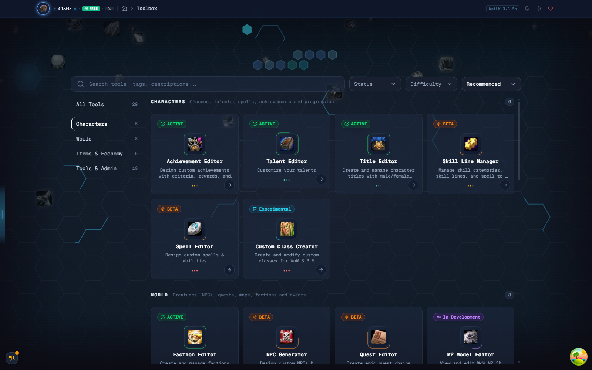
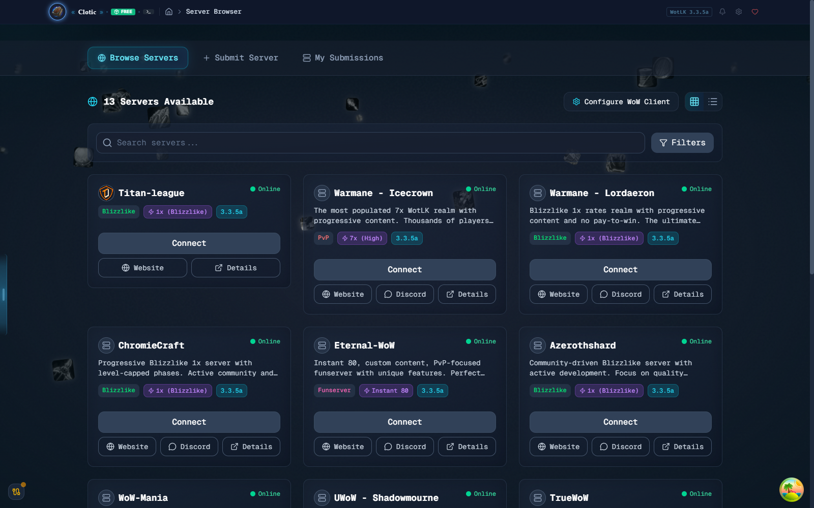
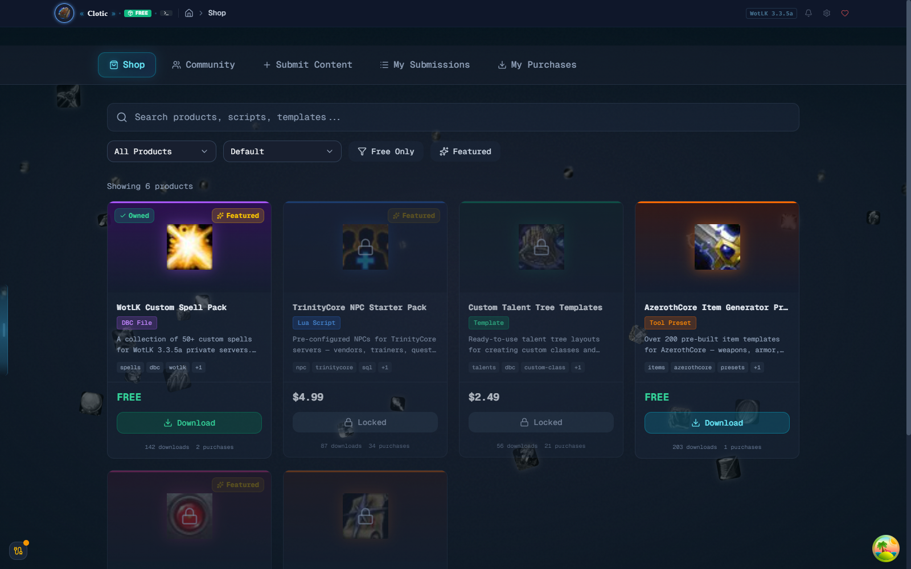
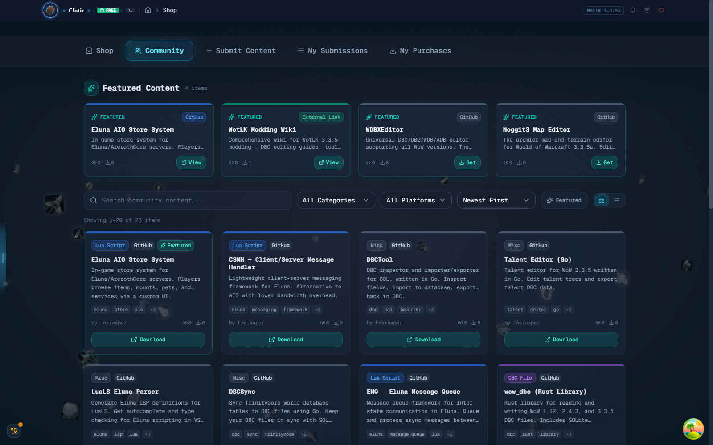
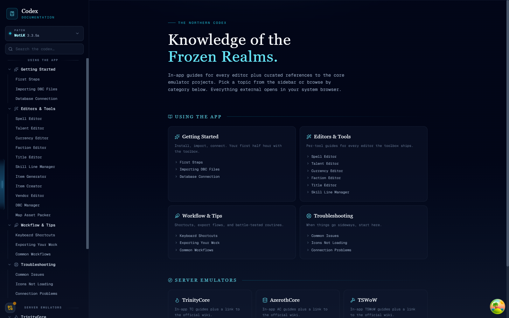
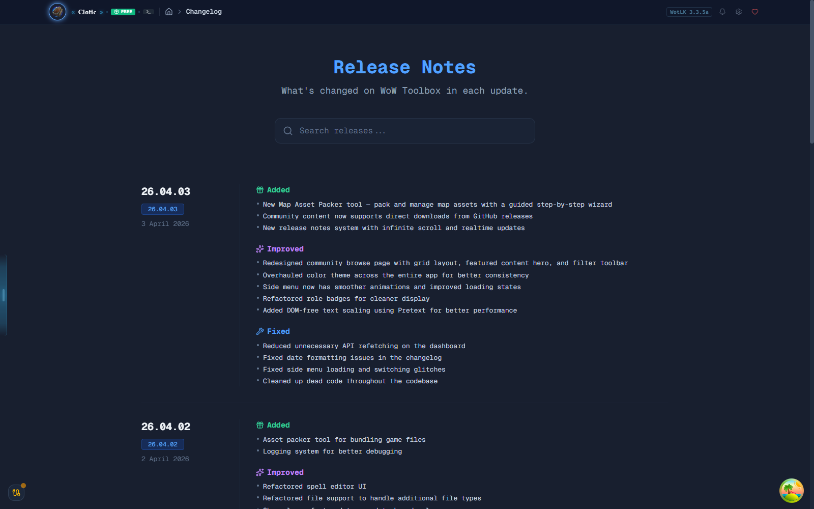

# WoW Toolbox

**Release repository for the WoW Toolbox desktop application** — a comprehensive
development kit for World of Warcraft 3.3.5a (Wrath of the Lich King).

Support for additional client versions is planned.

## Download

Grab the latest build from the [Releases](https://github.com/Isidorsson/wow-toolbox/releases) page.

## Features

- **Editors** — Achievement, Talent, Title, Spell, Quest, Faction, and NPC editors
- **Creators** — Skill Line Manager, Custom Class Creator, M2 Model Viewer
- **Server Browser** — discover, filter, and connect to 3.3.5a servers
- **Shop & Community** — download curated content packs and community submissions
- **Codex** — in-app documentation and guides for every tool
- **Changelog** — live release notes with search and realtime updates

## Screenshots

<table>
  <tr>
    <td align="center" width="50%">
      
      <b>Landing</b> — browse all editors and tools by category
    </td>
    <td align="center" width="50%">
      
      <b>Server Browser</b> — filter, connect, and submit servers
    </td>
  </tr>
  <tr>
    <td align="center" width="50%">
      
      <b>Shop</b> — content packs, templates, and tool add-ons
    </td>
    <td align="center" width="50%">
      
      <b>Community</b> — featured and community-submitted content
    </td>
  </tr>
  <tr>
    <td align="center" width="50%">
      
      <b>Codex</b> — in-app docs, guides, and server emulator references
    </td>
    <td align="center" width="50%">
      
      <b>Changelog</b> — searchable release notes with live updates
    </td>
  </tr>
</table>

---

**Note:** This is a release-only repository. Source code is maintained separately.
