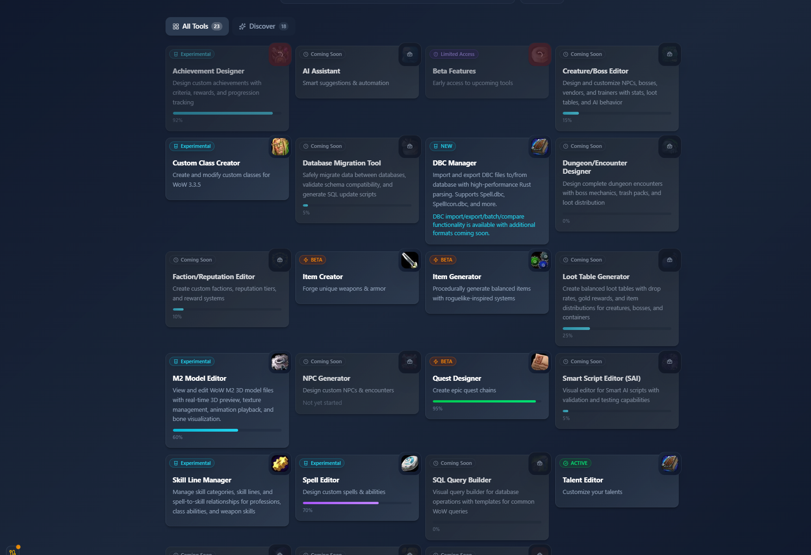
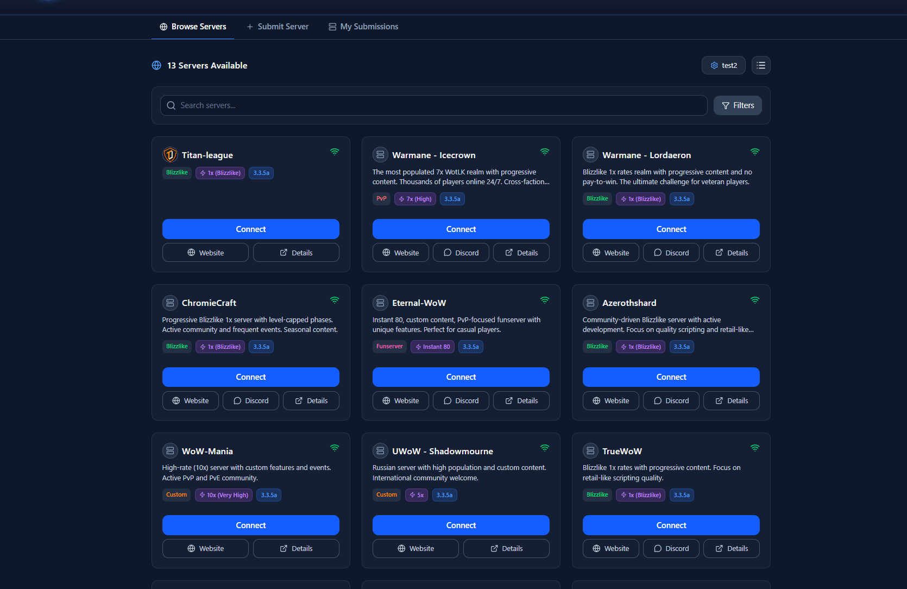
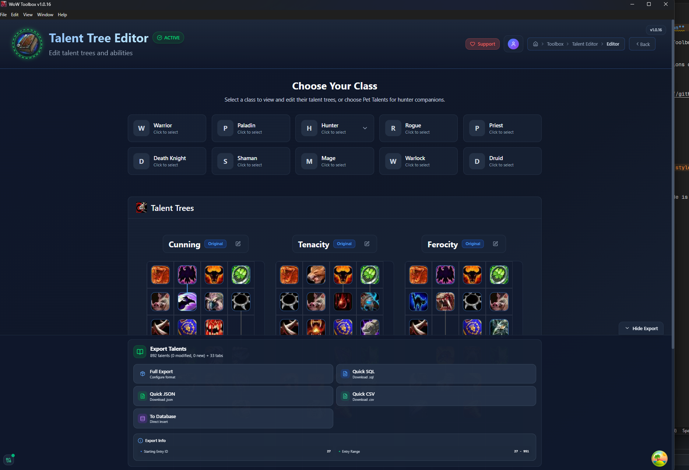
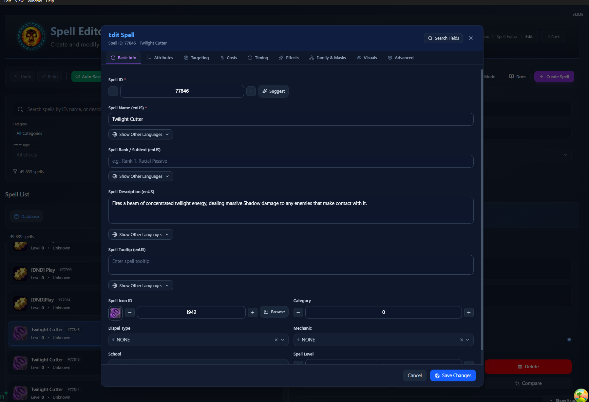
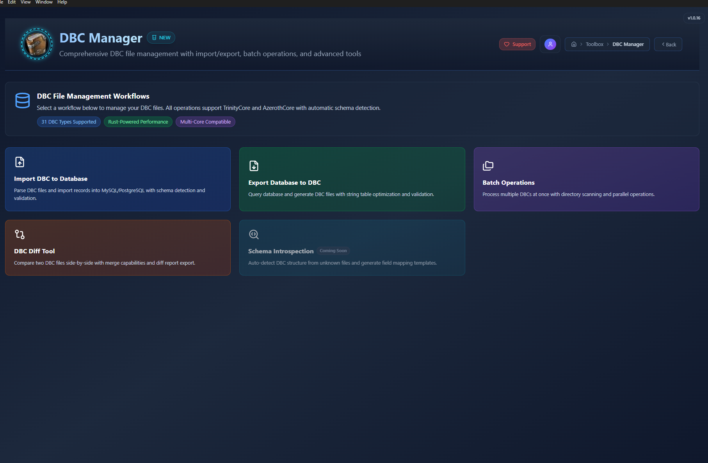

# WoW Toolbox

**Release repository for WoW Toolbox desktop application**

This repository contains compiled releases of the WoW Toolbox - a comprehensive World of Warcraft 3.3.5 (WotLK) development toolkit.

More will come soon!, Also will support for other versions of WoW in the future.

## Download

Download the latest version from the [Releases](https://github.com/Isidorsson/wow-toolbox/releases) page.

## Features

- Item Generator
- Spell Editor
- Quest Designer
- And more...

---

<table>
  <tr>
    <td></td>
    <td></td>
  </tr>
  <tr>
    <td></td>
    <td></td>
  </tr>
  <tr>
    <td colspan="2" align="center"></td>
  </tr>
</table>

---

**Note:** This is a release-only repository. Source code is maintained separately.
